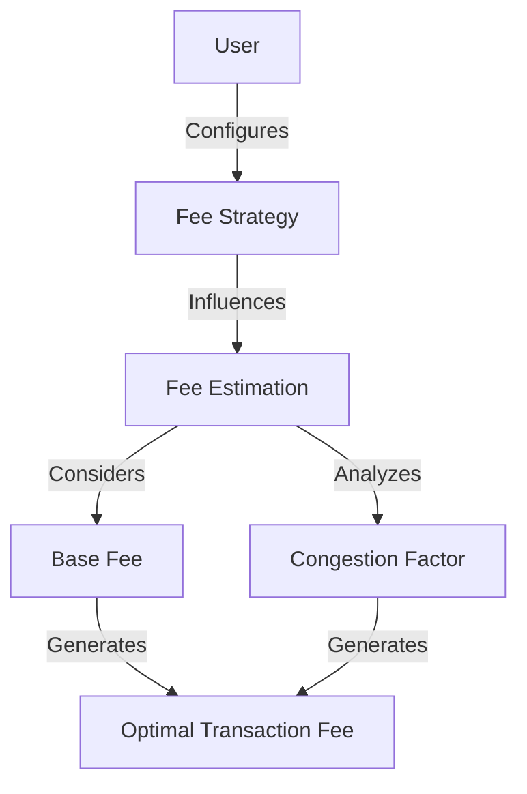

# EIP-1559 Speed: Ethereum Fee Optimization

A blockchain-based smart contract for dynamic Ethereum transaction fee optimization using the EIP-1559 standard. This solution provides developers and users with advanced tools for estimating, tracking, and strategizing transaction fees on the Ethereum network.

## Overview

The EIP-1559 Speed contract creates a comprehensive system for managing and predicting Ethereum transaction fees. It addresses critical challenges in fee estimation and network congestion management:

- Dynamic base fee tracking
- Personalized fee strategy configuration
- Network congestion analysis
- Predictive fee estimation
- Historical fee trend recording

Key features:
- Base fee recording
- Fee strategy customization
- Network congestion tracking
- Optimal fee estimation
- Historical fee trend analysis

## Architecture

The system consists of a single smart contract that manages Ethereum fee optimization. The architecture follows a multi-layer approach:

1. Base fee recording for each block
2. User-specific fee strategies
3. Network congestion factor tracking
4. Dynamic fee estimation



## Contract Documentation

### ethereum-fee-optimizer

The main contract handling Ethereum fee optimization functionality.

#### Data Storage
- `base-fee-records`: Block-height mapped base fee information
- `fee-strategies`: User-specific fee optimization strategies
- `fee-trends`: Historical fee trend data for predictive analysis

#### Key Capabilities
- Record and track base fees
- Set personalized fee strategies
- Estimate optimal transaction fees
- Analyze network congestion trends

## Getting Started

### Prerequisites
- Clarinet
- Ethereum network understanding
- Fee optimization requirements

### Installation

1. Clone the repository
2. Install dependencies with Clarinet
```bash
clarinet integrate
```

### Basic Usage

1. Record a base fee:
```clarity
(contract-call? .ethereum-fee-optimizer record-base-fee u1000 u20 u5 u75)
```

2. Set a personal fee strategy:
```clarity
(contract-call? .ethereum-fee-optimizer set-fee-strategy u50 u10 true)
```

3. Estimate optimal fee:
```clarity
(contract-call? .ethereum-fee-optimizer estimate-optimal-fee u20 u75)
```

## Function Reference

### Fee Recording Functions

```clarity
(record-base-fee (block-height uint) (base-fee uint) (priority-fee uint) (congestion-factor uint))
```
Records base fee information for a specific block.

```clarity
(set-fee-strategy (max-base-fee uint) (max-priority-fee uint) (dynamic-adjustment bool))
```
Configures a personalized fee strategy.

### Analysis Functions

```clarity
(record-fee-trend (start-block uint) (end-block uint) (avg-base-fee uint) (avg-priority-fee uint) (volatility-index uint))
```
Records fee trends across a block range for historical analysis.

### Query Functions

```clarity
(get-base-fee-info (block-height uint))
(get-fee-strategy (user principal))
(get-fee-trend (start-block uint) (end-block uint))
(estimate-optimal-fee (base-fee uint) (congestion-factor uint))
```

## Development

### Testing

Run the test suite:
```bash
clarinet test
```

### Local Development
1. Start Clarinet console:
```bash
clarinet console
```

2. Deploy contract:
```bash
clarinet deploy
```

## Security Considerations

### Limitations
- Fee estimations are probabilistic
- Historical data is block-height dependent
- Strategies are user-configurable but not guaranteed

### Best Practices
- Regularly update fee strategies
- Monitor network congestion
- Use dynamic adjustment
- Implement off-chain complementary analysis
- Understand Ethereum fee mechanism nuances

### Performance
- Minimal on-chain computational overhead
- Efficient storage of fee-related data
- Supports flexible fee optimization strategies